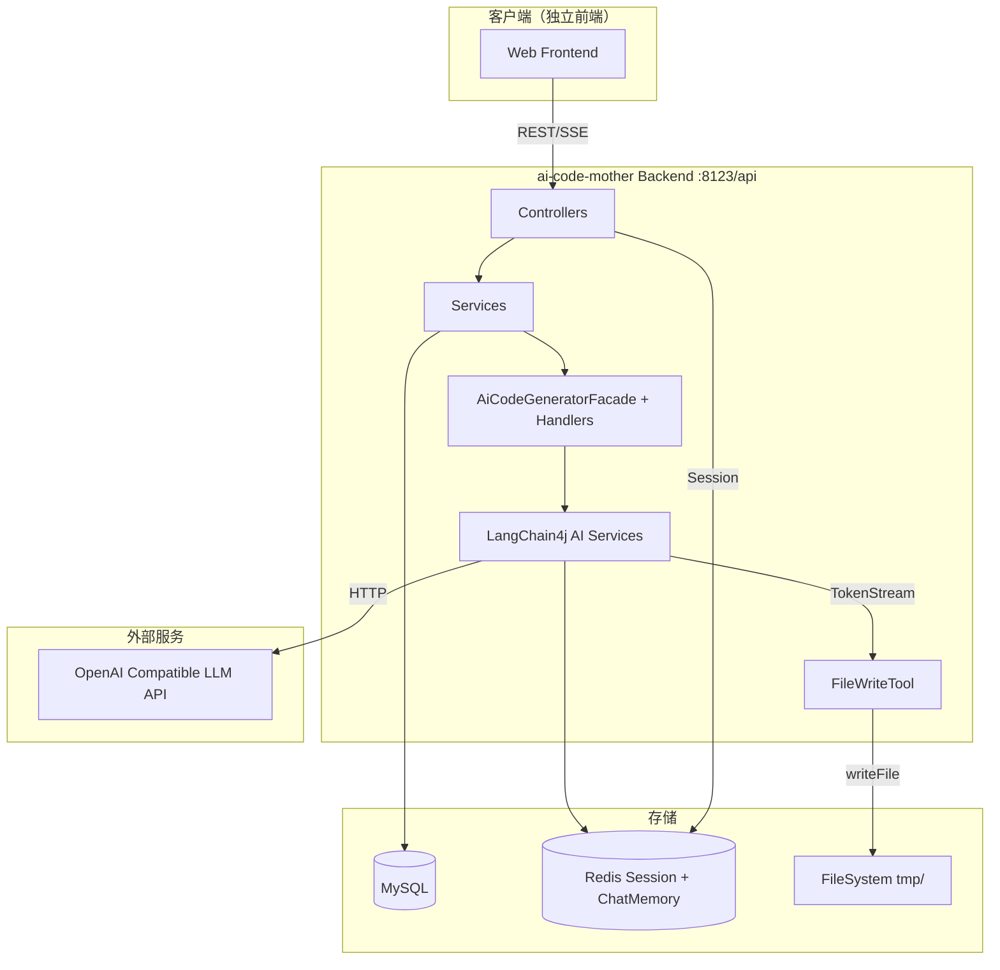

# ai-code-mother 项目架构文档

> 版本：0.0.1-SNAPSHOT  
> 最后更新：2026-08-05

---

## 目录

1. [项目概述](#1-项目概述)
2. [技术栈](#2-技术栈)
3. [系统架构](#3-系统架构)
4. [代码目录结构](#4-代码目录结构)
5. [核心模块说明](#5-核心模块说明)
6. [数据库设计](#6-数据库设计)
7. [REST API 接口文档](#7-rest-api-接口文档)
8. [核心业务流程](#8-核心业务流程)
9. [AI 集成方案](#9-ai-集成方案)
10. [配置说明](#10-配置说明)
11. [部署与运行](#11-部署与运行)
12. [使用指南](#12-使用指南)
13. [注意事项与已知问题](#13-注意事项与已知问题)

---

## 1. 项目概述

**ai-code-mother** 是一个基于 AI 的「对话式代码生成平台」后端服务。用户通过自然语言与 AI 对话，驱动 AI 自动生成前端代码，支持三种生成模式：

| 模式 | 枚举值 | 说明 |
|------|--------|------|
| 原生 HTML | `html` | 生成单个 HTML 文件 |
| 多文件 | `multi_file` | 生成 HTML + CSS + JS 三文件 |
| Vue 工程 | `vue_project` | 生成完整 Vue3 + Vite 工程（当前默认） |

核心能力：

- 流式 SSE 实时输出 AI 生成内容
- 对话历史持久化（MySQL）+ AI 记忆（Redis）
- 代码文件自动落盘
- Vue 项目自动 `npm install` + `npm run build`
- 一键部署预览

> 本仓库为**纯后端项目**，无内置前端代码，需独立前端调用 API。

---

## 2. 技术栈

| 类别 | 技术 | 版本 |
|------|------|------|
| 语言 | Java | 21 |
| 框架 | Spring Boot | 4.1.0 |
| Web | spring-boot-starter-webmvc | parent 管理 |
| AOP | spring-boot-starter-aspectj | parent 管理 |
| ORM | MyBatis-Flex | 1.11.8 |
| 数据库 | MySQL | 8+ |
| 连接池 | HikariCP | 4.0.3 |
| 缓存/Session | Spring Session + Redis | parent 管理 |
| AI 框架 | LangChain4j | 1.18.0 |
| AI Starter | langchain4j-open-ai-spring-boot4-starter | 1.18.0-beta28 |
| AI Redis | langchain4j-community-redis-spring-boot4-starter | 1.18.0-beta28 |
| 响应式 | langchain4j-reactor | 1.1.0-beta7 |
| 本地缓存 | Caffeine | parent 管理 |
| 工具库 | Hutool | 5.8.46 |
| API 文档 | Knife4j (OpenAPI3) | 4.4.0 |
| 其他 | Lombok | 1.18.44 |

---

## 3. 系统架构

### 3.1 分层架构

```
┌─────────────────────────────────────────────────────────────┐
│  Controller 层                                               │
│  AppController / UserController / ChatHistoryController      │
│  StaticResourceController / HealthController                 │
└──────────────────────────┬──────────────────────────────────┘
                           │
┌──────────────────────────▼──────────────────────────────────┐
│  Service 层                                                  │
│  AppServiceImpl / UserServiceImpl / ChatHistoryServiceImpl   │
└──────────────────────────┬──────────────────────────────────┘
                           │
┌──────────────────────────▼──────────────────────────────────┐
│  Core 层（业务编排）                                          │
│  AiCodeGeneratorFacade                                       │
│  StreamHandlerExecutor / CodeParserExecutor                  │
│  CodeFileSaverExecutor / VueProjectBuilder                   │
└──────────────────────────┬──────────────────────────────────┘
                           │
┌──────────────────────────▼──────────────────────────────────┐
│  AI 层                                                       │
│  AiCodeGeneratorServiceFactory → AiCodeGeneratorService      │
│  FileWriteTool / ValidatingChatMemoryStore                   │
│  LangChain4j (ChatModel / StreamingChatModel / TokenStream)  │
└──────────────────────────┬──────────────────────────────────┘
                           │
┌──────────────────────────▼──────────────────────────────────┐
│  基础设施                                                    │
│  MySQL（实体持久化）/ Redis（Session + ChatMemory）           │
│  文件系统（tmp/code_output, tmp/code_deploy）                │
└─────────────────────────────────────────────────────────────┘
```

### 3.2 横切关注点

| 能力 | 实现方式 |
|------|----------|
| 认证 | Spring Session（Redis 存储），Session Key = `user_login` |
| 鉴权 | `@AuthCheck(mustRole = "admin")` + `AuthInterceptor` AOP |
| 异常 | `GlobalExceptionHandler` 统一处理 `BusinessException` |
| 跨域 | `CorsConfig` 全局放行 |
| API 文档 | Knife4j + springdoc-openapi |

### 3.3 系统交互图



---

## 4. 代码目录结构

```
ai-code-mother/
├── pom.xml                                    # Maven 依赖配置
├── sql/
│   └── create_table.sql                       # 数据库建表脚本
├── docs/
│   └── ARCHITECTURE.md                        # 本文档
├── src/
│   ├── main/
│   │   ├── java/com/wbq/aicodemother/
│   │   │   ├── AiCodeMotherApplication.java   # Spring Boot 启动类
│   │   │   │
│   │   │   ├── annotation/                    # 自定义注解
│   │   │   │   └── AuthCheck.java             # 权限校验注解
│   │   │   │
│   │   │   ├── aop/                           # AOP 切面
│   │   │   │   └── AuthInterceptor.java       # 权限拦截器
│   │   │   │
│   │   │   ├── ai/                            # AI 核心层
│   │   │   │   ├── AiCodeGeneratorService.java        # LangChain4j AI 服务接口
│   │   │   │   ├── AiCodeGeneratorServiceFactory.java # AI 服务工厂（缓存+记忆）
│   │   │   │   ├── memory/
│   │   │   │   │   └── ValidatingChatMemoryStore.java # 对话记忆校验装饰器
│   │   │   │   ├── model/
│   │   │   │   │   ├── HtmlCodeResult.java            # HTML 结构化输出
│   │   │   │   │   ├── MultiFileCodeResult.java       # 多文件结构化输出
│   │   │   │   │   └── message/                       # 流式消息模型
│   │   │   │   │       ├── StreamMessage.java
│   │   │   │   │       ├── AiResponseMessage.java
│   │   │   │   │       ├── ToolRequestMessage.java
│   │   │   │   │       └── ToolExecutedMessage.java
│   │   │   │   └── tools/
│   │   │   │       └── FileWriteTool.java             # AI 文件写入工具
│   │   │   │
│   │   │   ├── common/                        # 通用组件
│   │   │   │   ├── BaseResponse.java          # 统一响应体
│   │   │   │   ├── PageRequest.java           # 分页请求基类
│   │   │   │   ├── DeleteRequest.java         # 删除请求
│   │   │   │   └── ResultUtils.java           # 响应工具类
│   │   │   │
│   │   │   ├── config/                        # Spring 配置
│   │   │   │   ├── CorsConfig.java            # 跨域配置
│   │   │   │   ├── JsonConfig.java            # JSON 序列化配置
│   │   │   │   └── ReasoningStreamingChatModelConfig.java # 推理模型配置
│   │   │   │
│   │   │   ├── constant/                      # 常量
│   │   │   │   ├── AppConstant.java           # 应用相关常量
│   │   │   │   └── UserConstant.java          # 用户相关常量
│   │   │   │
│   │   │   ├── controller/                    # REST 控制器
│   │   │   │   ├── AppController.java         # 应用管理 + 代码生成
│   │   │   │   ├── UserController.java        # 用户管理
│   │   │   │   ├── ChatHistoryController.java # 对话历史
│   │   │   │   ├── StaticResourceController.java # 静态资源预览
│   │   │   │   └── HealthController.java      # 健康检查
│   │   │   │
│   │   │   ├── core/                          # 核心业务编排
│   │   │   │   ├── AiCodeGeneratorFacade.java # 代码生成统一入口
│   │   │   │   ├── builder/
│   │   │   │   │   └── VueProjectBuilder.java # Vue 项目构建（npm）
│   │   │   │   ├── handler/
│   │   │   │   │   ├── StreamHandlerExecutor.java    # 流处理器路由
│   │   │   │   │   ├── SimpleTextStreamHandler.java  # HTML/MULTI_FILE 流处理
│   │   │   │   │   └── JsonMessageStreamHandler.java # VUE_PROJECT 流处理
│   │   │   │   ├── parser/
│   │   │   │   │   ├── CodeParser.java
│   │   │   │   │   ├── MultiFileCodeParser.java
│   │   │   │   │   └── CodeParserExecutor.java       # 代码解析执行器
│   │   │   │   └── saver/
│   │   │   │       ├── CodeFileSaverTemplate.java    # 保存模板（模板方法模式）
│   │   │   │       ├── HtmlCodeFileSaverTemplate.java
│   │   │   │       ├── MultiFileCodeFileSaverTemplate.java
│   │   │   │       └── CodeFileSaverExecutor.java    # 保存执行器
│   │   │   │
│   │   │   ├── exception/                     # 异常体系
│   │   │   │   ├── BusinessException.java
│   │   │   │   ├── ErrorCode.java
│   │   │   │   ├── GlobalExceptionHandler.java
│   │   │   │   └── ThrowUtils.java
│   │   │   │
│   │   │   ├── generator/                     # MyBatis 代码生成器
│   │   │   │   └── MyBatisCodeGenerator.java
│   │   │   │
│   │   │   ├── mapper/                        # MyBatis-Flex Mapper
│   │   │   │   ├── UserMapper.java
│   │   │   │   ├── AppMapper.java
│   │   │   │   └── ChatHistoryMapper.java
│   │   │   │
│   │   │   ├── model/                         # 数据模型
│   │   │   │   ├── dto/                       # 请求 DTO
│   │   │   │   │   ├── app/
│   │   │   │   │   ├── user/
│   │   │   │   │   └── chathistory/
│   │   │   │   ├── entity/                    # 数据库实体
│   │   │   │   │   ├── User.java
│   │   │   │   │   ├── App.java
│   │   │   │   │   └── ChatHistory.java
│   │   │   │   ├── enums/                     # 枚举
│   │   │   │   │   ├── CodeGenTypeEnum.java
│   │   │   │   │   ├── ChatHistoryMessageTypeEnum.java
│   │   │   │   │   └── UserRoleEnum.java
│   │   │   │   └── vo/                        # 响应 VO
│   │   │   │       ├── AppVO.java
│   │   │   │       ├── UserVO.java
│   │   │   │       └── LoginUserVO.java
│   │   │   │
│   │   │   └── service/                       # 服务层
│   │   │       ├── AppService.java
│   │   │       ├── UserService.java
│   │   │       ├── ChatHistoryService.java
│   │   │       └── impl/
│   │   │           ├── AppServiceImpl.java
│   │   │           ├── UserServiceImpl.java
│   │   │           └── ChatHistoryServiceImpl.java
│   │   │
│   │   └── resources/
│   │       ├── application.yaml               # 主配置
│   │       ├── application-local.yaml         # 本地配置（gitignore，需自行创建）
│   │       ├── mapper/                        # MyBatis XML
│   │       └── prompt/                        # AI System Prompt
│   │           ├── codegen-html-system-prompt.txt
│   │           ├── codegen-multi-file-system-prompt.txt
│   │           └── codegen-vue-project-system-prompt.txt
│   │
│   └── test/                                  # 单元测试
│       └── java/com/wbq/aicodemother/
│           ├── AiCodeMotherApplicationTests.java
│           ├── ai/AiCodeGeneratorServiceTest.java
│           └── core/
│               ├── AiCodeGeneratorFacadeTest.java
│               └── CodeParserTest.java
│
└── tmp/                                       # 运行时生成（gitignore）
    ├── code_output/                           # AI 生成代码目录
    │   ├── html_{appId}/
    │   ├── multi_file_{appId}/
    │   └── vue_project_{appId}/
    └── code_deploy/                           # 部署目录
        └── {deployKey}/
```

---

## 5. 核心模块说明

### 5.1 AiCodeGeneratorFacade

代码生成的统一入口，根据 `CodeGenTypeEnum` 分发到不同处理链路：

| 类型 | 输入 | 输出 | 后处理 |
|------|------|------|--------|
| HTML | `Flux<String>` | 流式文本 | 流结束后解析 + 保存 `index.html` |
| MULTI_FILE | `Flux<String>` | 流式文本 | 流结束后解析 + 保存三文件 |
| VUE_PROJECT | `TokenStream` | JSON 消息流 | 工具调用写文件 + 异步 npm build |

### 5.2 AiCodeGeneratorServiceFactory

- 按 `appId + codeGenType` 缓存 AI 服务实例（Caffeine，最大 1000，写后 30min / 访问后 10min 过期）
- 每个应用独立 `MessageWindowChatMemory`（最多 20 条，Redis 持久化）
- VUE_PROJECT 模式使用推理模型 + `FileWriteTool`，每轮对话前清空记忆

### 5.3 StreamHandlerExecutor

流式响应后处理路由：

- `HTML / MULTI_FILE` → `SimpleTextStreamHandler`：收集完整文本，保存 AI 回复到 `chat_history`
- `VUE_PROJECT` → `JsonMessageStreamHandler`：解析 JSON 消息（AI 文本 / 工具请求 / 工具执行），格式化输出，保存历史，触发 Vue 构建

### 5.4 FileWriteTool

LangChain4j AI 工具，供 VUE_PROJECT 模式调用：

```
writeFile(relativeFilePath, content, totalFiles, appId)
→ 写入 tmp/code_output/vue_project_{appId}/{relativeFilePath}
→ 达到 totalFiles 后返回结束信号
```

### 5.5 VueProjectBuilder

代码生成完成后异步执行：

1. `npm install`（超时 5 分钟）
2. `npm run build`（超时 3 分钟）
3. 验证 `dist/` 目录生成

使用 Java 21 虚拟线程，不阻塞主流程。

---

## 6. 数据库设计

### 6.1 ER 关系

```
user (1) ──── (N) app (1) ──── (N) chat_history
```

### 6.2 表结构

#### user — 用户表

| 字段 | 类型 | 说明 |
|------|------|------|
| id | bigint PK AUTO_INCREMENT | 用户 ID |
| userAccount | varchar(256) UNIQUE | 账号 |
| userPassword | varchar(512) | 密码（MD5 + 盐） |
| userName | varchar(256) | 昵称 |
| userAvatar | varchar(1024) | 头像 URL |
| userProfile | varchar(512) | 简介 |
| userRole | varchar(256) DEFAULT 'user' | 角色：user / admin |
| editTime | datetime | 编辑时间 |
| createTime | datetime | 创建时间 |
| updateTime | datetime | 更新时间 |
| isDelete | tinyint DEFAULT 0 | 逻辑删除 |

#### app — 应用表

| 字段 | 类型 | 说明 |
|------|------|------|
| id | bigint PK | 应用 ID（雪花算法） |
| appName | varchar(256) | 应用名称 |
| cover | varchar(512) | 封面 |
| initPrompt | text | 初始化 prompt |
| codeGenType | varchar(64) | 代码生成类型（html / multi_file / vue_project） |
| deployKey | varchar(64) UNIQUE | 部署标识（6 位随机字符串） |
| deployedTime | datetime | 部署时间 |
| priority | int DEFAULT 0 | 优先级（99 = 精选） |
| userId | bigint | 创建用户 ID |
| editTime / createTime / updateTime | datetime | 时间戳 |
| isDelete | tinyint DEFAULT 0 | 逻辑删除 |

#### chat_history — 对话历史表

| 字段 | 类型 | 说明 |
|------|------|------|
| id | bigint PK | 记录 ID（雪花算法） |
| message | text | 消息内容 |
| messageType | varchar(32) | user / ai |
| appId | bigint | 应用 ID |
| userId | bigint | 用户 ID |
| createTime / updateTime | datetime | 时间戳 |
| isDelete | tinyint DEFAULT 0 | 逻辑删除 |

**索引**：`idx_appId_createTime(appId, createTime)` — 游标分页核心索引

### 6.3 枚举

| 枚举 | 值 | 说明 |
|------|-----|------|
| `CodeGenTypeEnum` | html, multi_file, vue_project | 代码生成类型 |
| `ChatHistoryMessageTypeEnum` | user, ai | 消息类型 |
| `UserRoleEnum` | user, admin | 用户角色 |

---

## 7. REST API 接口文档

> **全局前缀**：`/api`（`server.servlet.context-path`）  
> **统一响应**：`BaseResponse<T> { code, data, message }`，成功时 `code = 0`  
> **认证方式**：Session Cookie（登录后自动携带）  
> **在线文档**：`http://localhost:8123/api/doc.html`

### 7.1 错误码

| code | 说明 |
|------|------|
| 0 | 成功 |
| 40000 | 请求参数错误 |
| 40100 | 未登录 |
| 40101 | 无权限 |
| 40300 | 禁止访问 |
| 40400 | 数据不存在 |
| 50000 | 系统内部异常 |
| 50001 | 操作失败 |

---

### 7.2 健康检查

**GET** `/api/health/`

| 项 | 值 |
|----|-----|
| 权限 | 公开 |
| 响应 | `{ "code": 0, "data": "ok", "message": "" }` |

---

### 7.3 用户模块 `/api/user`

#### POST `/user/register` — 用户注册

**请求体**：
```json
{
  "userAccount": "testuser",
  "userPassword": "12345678",
  "checkPassword": "12345678"
}
```

**响应**：`BaseResponse<Long>` — 新用户 ID

---

#### POST `/user/login` — 用户登录

**请求体**：
```json
{
  "userAccount": "testuser",
  "userPassword": "12345678"
}
```

**响应**：`BaseResponse<LoginUserVO>`

```json
{
  "code": 0,
  "data": {
    "id": 1,
    "userAccount": "testuser",
    "userName": "testuser",
    "userAvatar": null,
    "userRole": "user"
  }
}
```

登录成功后 Session 写入 Redis，后续请求自动携带 Cookie。

---

#### GET `/user/get/login` — 获取当前登录用户

| 项 | 值 |
|----|-----|
| 权限 | 需登录 |
| 响应 | `BaseResponse<LoginUserVO>` |

---

#### POST `/user/logout` — 退出登录

| 项 | 值 |
|----|-----|
| 权限 | 需登录 |
| 响应 | `BaseResponse<Boolean>` |

---

#### 管理员接口（需 `@AuthCheck admin`）

| 方法 | 路径 | 说明 |
|------|------|------|
| POST | `/user/add` | 创建用户（默认密码 12345678） |
| GET | `/user/get?id=` | 获取用户实体 |
| POST | `/user/delete` | 删除用户 |
| POST | `/user/update` | 更新用户 |
| POST | `/user/list/page/vo` | 分页查询用户 |

**UserQueryRequest 分页参数**：
```json
{
  "pageNum": 1,
  "pageSize": 10,
  "userAccount": "",
  "userName": "",
  "userRole": "",
  "sortField": "createTime",
  "sortOrder": "descend"
}
```

---

### 7.4 应用模块 `/api/app`

#### POST `/app/add` — 创建应用

| 项 | 值 |
|----|-----|
| 权限 | 需登录 |

**请求体**：
```json
{
  "initPrompt": "帮我做一个待办事项管理页面",
  "appName": "待办事项"
}
```

**响应**：`BaseResponse<Long>` — 应用 ID

**后端逻辑**：
- `appName` 未传时取 `initPrompt` 前 12 字符
- `codeGenType` 默认 `vue_project`
- `priority` 默认 1

---

#### GET `/app/chat/gen/code` — 流式 AI 代码生成（核心接口）

| 项 | 值 |
|----|-----|
| 权限 | 需登录（仅应用创建者） |
| Content-Type | `text/event-stream` |

**Query 参数**：

| 参数 | 类型 | 必填 | 说明 |
|------|------|------|------|
| appId | Long | 是 | 应用 ID |
| message | String | 是 | 用户消息 |

**SSE 响应格式**：

```
data: {"d":"<chunk>"}

data: {"d":"<chunk>"}

event: done
data: "e"
```

- 普通数据块：`{"d": "<内容片段>"}`
- 结束事件：`event: done`, `data: "e"`
- VUE_PROJECT 模式下，`d` 字段内容为格式化后的文本（含工具调用信息）

**前端接入示例**：
```javascript
const eventSource = new EventSource(
  `/api/app/chat/gen/code?appId=${appId}&message=${encodeURIComponent(message)}`,
  { withCredentials: true }
);

eventSource.onmessage = (event) => {
  const { d } = JSON.parse(event.data);
  appendContent(d);
};

eventSource.addEventListener('done', () => {
  eventSource.close();
});
```

---

#### POST `/app/deploy` — 部署应用

| 项 | 值 |
|----|-----|
| 权限 | 需登录（仅应用创建者） |

**请求体**：
```json
{
  "appId": 1234567890
}
```

**响应**：`BaseResponse<String>` — 部署 URL

```
http://localhost:8080/{deployKey}/
```

**逻辑**：
1. 生成/复用 6 位 `deployKey`
2. 复制 `tmp/code_output/{codeGenType}_{appId}/` → `tmp/code_deploy/{deployKey}/`
3. 更新数据库 `deployKey` + `deployedTime`

---

#### POST `/app/update` — 更新应用

| 项 | 值 |
|----|-----|
| 权限 | 需登录（仅创建者，仅可改 appName） |

```json
{ "id": 123, "appName": "新名称" }
```

---

#### POST `/app/delete` — 删除应用

| 项 | 值 |
|----|-----|
| 权限 | 需登录（创建者或 admin） |

```json
{ "id": 123 }
```

删除应用时同步删除关联的 `chat_history` 记录。

---

#### GET `/app/get/vo?id=` — 获取应用详情

| 项 | 值 |
|----|-----|
| 权限 | 公开 |
| 响应 | `BaseResponse<AppVO>`（含创建者 UserVO） |

---

#### POST `/app/my/list/page/vo` — 分页查自己的应用

| 项 | 值 |
|----|-----|
| 权限 | 需登录 |
| pageSize 上限 | 20 |

```json
{
  "pageNum": 1,
  "pageSize": 10,
  "appName": "",
  "sortField": "createTime",
  "sortOrder": "descend"
}
```

---

#### POST `/app/good/list/page/vo` — 分页查精选应用

| 项 | 值 |
|----|-----|
| 权限 | 公开 |
| 筛选条件 | priority = 99 |

---

#### 管理员接口

| 方法 | 路径 | 说明 |
|------|------|------|
| POST | `/app/admin/delete` | 删除任意应用 |
| POST | `/app/admin/update` | 更新任意应用（AppAdminUpdateRequest） |
| GET | `/app/admin/get?id=` | 获取应用详情 |
| POST | `/app/admin/list/page/vo` | 分页查全部应用 |

---

### 7.5 对话历史 `/api/chatHistory`

#### GET `/chatHistory/app/{appId}` — 游标分页查应用对话

| 项 | 值 |
|----|-----|
| 权限 | 需登录（创建者或 admin） |

**Query 参数**：

| 参数 | 类型 | 默认值 | 说明 |
|------|------|--------|------|
| pageSize | int | 10 | 每页条数（1-50） |
| lastCreateTime | datetime | null | 游标，取此时间之前的记录 |

**响应**：`BaseResponse<Page<ChatHistory>>`

**游标分页用法**：
1. 首次请求不传 `lastCreateTime`
2. 取返回结果中最后一条的 `createTime` 作为下次请求的 `lastCreateTime`
3. 重复直到返回空列表

---

#### POST `/chatHistory/admin/list/page/vo` — 管理员查全部对话

| 项 | 值 |
|----|-----|
| 权限 | admin |

---

### 7.6 静态资源 `/api/static`

#### GET `/static/{deployKey}/**` — 静态资源预览

| 项 | 值 |
|----|-----|
| 权限 | 公开 |

**示例**：
```
GET /api/static/abc123/index.html
GET /api/static/abc123/style.css
```

> 注意：当前实现从 `tmp/code_output/{deployKey}/` 读取，与代码实际存储路径 `{codeGenType}_{appId}` 不一致，详见 [已知问题](#13-注意事项与已知问题)。

---

## 8. 核心业务流程

### 8.1 完整使用流程

```
1. 注册/登录          POST /api/user/register → POST /api/user/login
2. 创建应用           POST /api/app/add { initPrompt }
3. 对话生成代码       GET  /api/app/chat/gen/code?appId=&message=  (SSE)
4. 查看对话历史       GET  /api/chatHistory/app/{appId}
5. 部署预览           POST /api/app/deploy { appId }
6. 访问部署 URL       http://localhost:8080/{deployKey}/
```

### 8.2 代码生成流程

```
GET /api/app/chat/gen/code
  │
  ├─ AppServiceImpl.chatToGenCode()
  │    ├─ 校验 appId / message / 权限
  │    ├─ VUE_PROJECT: 重置 FileWriteTool 计数 + 清空 Redis 记忆
  │    ├─ 保存用户消息 → chat_history
  │    └─ AiCodeGeneratorFacade.generateAndSaveCodeStream()
  │
  ├─ 按 codeGenType 分发
  │    │
  │    ├─ HTML / MULTI_FILE
  │    │    ├─ AiCodeGeneratorService.generateXxxCodeStream()
  │    │    ├─ Flux<String> 流式文本
  │    │    ├─ 流结束后: CodeParserExecutor 解析 → CodeFileSaverExecutor 保存
  │    │    └─ SimpleTextStreamHandler 保存 AI 回复
  │    │
  │    └─ VUE_PROJECT
  │         ├─ AiCodeGeneratorService.generateVueProjectCodeStream()
  │         ├─ TokenStream → JSON 消息流 (ai_response / tool_request / tool_executed)
  │         ├─ FileWriteTool 写入文件到 tmp/code_output/vue_project_{appId}/
  │         ├─ JsonMessageStreamHandler 格式化 + 保存 AI 回复
  │         └─ 完成后异步 VueProjectBuilder.buildProjectAsync()
  │
  └─ 包装为 SSE 返回前端
```

### 8.3 代码输出目录

| 类型 | 目录 | 文件 |
|------|------|------|
| HTML | `tmp/code_output/html_{appId}/` | index.html |
| MULTI_FILE | `tmp/code_output/multi_file_{appId}/` | index.html, style.css, script.js |
| VUE_PROJECT | `tmp/code_output/vue_project_{appId}/` | 完整 Vue 工程 + dist/ |

### 8.4 对话记忆策略

| 模式 | 记忆来源 | 说明 |
|------|----------|------|
| HTML / MULTI_FILE | 加载 user + ai 消息（最近 20 条） | 完整对话上下文 |
| VUE_PROJECT | 仅加载 user 消息（最近 20 条） | 避免 tool call 链污染记忆 |

记忆存储：Redis（TTL 3600s），经 `ValidatingChatMemoryStore` 过滤无效 AiMessage、修复 tool call 链。

---

## 9. AI 集成方案

### 9.1 架构

```
AiCodeGeneratorService (@SystemMessage fromResource)
    ↑ AiServices.builder() 动态代理
AiCodeGeneratorServiceFactory
    ├── ChatModel                    → 同步调用
    ├── openAiStreamingChatModel     → HTML/MULTI_FILE 流式
    ├── reasoningStreamingChatModel  → VUE_PROJECT 流式 + 工具调用
    ├── ChatMemoryStore              → Redis + ValidatingChatMemoryStore
    └── Caffeine Cache               → 按 appId_codeGenType 缓存实例
```

### 9.2 模型配置

| Bean | 配置来源 | 用途 | 模型 |
|------|----------|------|------|
| `ChatModel` | langchain4j starter 自动配置 | 同步调用 | application-local.yaml |
| `openAiStreamingChatModel` | starter 自动配置 | HTML/MULTI_FILE 流式 | application-local.yaml |
| `reasoningStreamingChatModel` | `ReasoningStreamingChatModelConfig` | VUE_PROJECT | deepseek-v4-flash, maxTokens=16384 |

配置前缀：`langchain4j.open-ai.chat-model`

### 9.3 AI 服务方法

| 方法 | Prompt 文件 | 返回类型 | 模式 |
|------|------------|---------|------|
| `generateHtmlCode` | codegen-html-system-prompt.txt | `HtmlCodeResult` | 同步 |
| `generateMultiFileCode` | codegen-multi-file-system-prompt.txt | `MultiFileCodeResult` | 同步 |
| `generateHtmlCodeStream` | 同上 | `Flux<String>` | 流式 |
| `generateMultiFileCodeStream` | 同上 | `Flux<String>` | 流式 |
| `generateVueProjectCodeStream` | codegen-vue-project-system-prompt.txt | `TokenStream` | 流式 + 工具 |

### 9.4 VUE_PROJECT 流式消息格式

AI 层输出的 JSON 消息类型：

```json
// AI 文本片段
{ "type": "ai_response", "data": "正在生成..." }

// 工具调用请求
{ "type": "tool_request", "id": "call_xxx", "name": "writeFile", "arguments": "..." }

// 工具执行结果
{ "type": "tool_executed", "id": "call_xxx", "name": "writeFile", "arguments": "{...}", "result": "..." }
```

经 `JsonMessageStreamHandler` 转换后，前端收到的是格式化纯文本。

---

## 10. 配置说明

### 10.1 application.yaml

```yaml
spring:
  application.name: ai-code-mother-backend
  session:
    store-type: redis
    timeout: 2592000          # Session 30 天
  datasource:
    url: jdbc:mysql://localhost:3306/ai_code_mother
    username: root
    password: <your-password>
  data.redis:
    host: localhost
    port: 6379
    ttl: 3600                 # ChatMemory TTL
  profiles.active: local

server:
  port: 8123
  servlet:
    context-path: /api
    session.cookie.max-age: 2592000
```

### 10.2 application-local.yaml（需自行创建，已 gitignore）

```yaml
langchain4j:
  open-ai:
    chat-model:
      base-url: https://api.deepseek.com/v1    # OpenAI 兼容端点
      api-key: sk-xxxxxxxxxxxxxxxx
      model-name: deepseek-chat
      # streaming-chat-model 使用相同前缀配置
```

### 10.3 硬编码常量

| 常量 | 值 | 说明 |
|------|-----|------|
| `CODE_OUTPUT_ROOT_DIR` | `{user.dir}/tmp/code_output` | AI 生成代码目录 |
| `CODE_DEPLOY_ROOT_DIR` | `{user.dir}/tmp/code_deploy` | 部署目录 |
| `CODE_DEPLOY_HOST` | `http://localhost:8080` | 部署访问域名 |
| `GOOD_APP_PRIORITY` | 99 | 精选应用优先级 |
| `DEFAULT_APP_PRIORITY` | 1 | 默认优先级 |

---

## 11. 部署与运行

### 11.1 环境要求

| 依赖 | 版本 | 说明 |
|------|------|------|
| JDK | 21 | 必须 |
| MySQL | 8+ | 创建库 `ai_code_mother` |
| Redis | 6+ | 本地 6379 |
| Node.js + npm | 18+ | Vue 项目构建需要 |
| Maven | 3.8+ | 或使用项目自带 mvnw |

### 11.2 初始化

```bash
# 1. 创建数据库
mysql -u root -p < sql/create_table.sql

# 2. 创建本地配置
cat > src/main/resources/application-local.yaml << 'EOF'
langchain4j:
  open-ai:
    chat-model:
      base-url: https://api.deepseek.com/v1
      api-key: YOUR_API_KEY
      model-name: deepseek-chat
EOF

# 3. 修改 application.yaml 中的数据库密码
```

### 11.3 启动

```bash
# 开发模式
./mvnw spring-boot:run

# 打包运行
./mvnw package -DskipTests
java -jar target/ai-code-mother-0.0.1-SNAPSHOT.jar
```

### 11.4 访问地址

| 服务 | 地址 |
|------|------|
| 后端 API | http://localhost:8123/api |
| 健康检查 | http://localhost:8123/api/health/ |
| API 文档 | http://localhost:8123/api/doc.html |
| 静态预览 | http://localhost:8123/api/static/{deployKey}/ |

---

## 12. 使用指南

### 12.1 快速体验（curl）

```bash
# 1. 注册
curl -X POST http://localhost:8123/api/user/register \
  -H "Content-Type: application/json" \
  -d '{"userAccount":"demo","userPassword":"12345678","checkPassword":"12345678"}' \
  -c cookies.txt

# 2. 登录
curl -X POST http://localhost:8123/api/user/login \
  -H "Content-Type: application/json" \
  -d '{"userAccount":"demo","userPassword":"12345678"}' \
  -c cookies.txt

# 3. 创建应用
curl -X POST http://localhost:8123/api/app/add \
  -H "Content-Type: application/json" \
  -b cookies.txt \
  -d '{"initPrompt":"帮我做一个计数器页面"}'

# 4. 流式生成代码（替换 APP_ID）
curl -N "http://localhost:8123/api/app/chat/gen/code?appId=APP_ID&message=开始生成" \
  -b cookies.txt

# 5. 部署
curl -X POST http://localhost:8123/api/app/deploy \
  -H "Content-Type: application/json" \
  -b cookies.txt \
  -d '{"appId": APP_ID}'

# 6. 查看对话历史
curl "http://localhost:8123/api/chatHistory/app/APP_ID?pageSize=10" \
  -b cookies.txt
```

### 12.2 前端集成要点

1. **Session 认证**：所有需登录接口携带 Cookie（`withCredentials: true`）
2. **SSE 流式**：使用 `EventSource` 或 `fetch` + `ReadableStream` 接收代码生成流
3. **SSE 结束判断**：监听 `event: done` 事件
4. **游标分页**：对话历史使用 `lastCreateTime` 游标，非传统页码分页
5. **CORS**：后端已全局放行，前端可直接跨域调用

### 12.3 管理员操作

```bash
# 创建管理员账号（直接在数据库修改 userRole）
UPDATE user SET userRole = 'admin' WHERE userAccount = 'demo';

# 设置精选应用
curl -X POST http://localhost:8123/api/app/admin/update \
  -H "Content-Type: application/json" \
  -b cookies.txt \
  -d '{"id": APP_ID, "priority": 99}'
```

---

## 13. 注意事项与已知问题

### 13.1 静态资源路径不一致

- **部署**：复制到 `tmp/code_deploy/{deployKey}/`，返回 URL 为 `http://localhost:8080/{deployKey}/`
- **StaticResourceController**：从 `tmp/code_output/{deployKey}/` 读取
- **代码生成**：实际存储在 `tmp/code_output/{codeGenType}_{appId}/`

三者路径不一致，静态预览接口 `/api/static/{deployKey}/` 可能无法正确访问已生成的代码。部署 URL 依赖外部 8080 端口的静态服务。

### 13.2 VUE_PROJECT 每轮清空记忆

每次对话前会 `resetVueProjectSession(appId)`，清空 Redis 中的 AI 记忆并重建服务实例。多轮对话的上下文依赖 `chat_history` 表中加载的用户消息，而非 Redis 记忆。

### 13.3 推理模型硬编码

`ReasoningStreamingChatModelConfig` 中模型名 `deepseek-v4-flash` 和 `maxTokens=16384` 为硬编码，切换模型需修改源码。

### 13.4 Vue 构建依赖

VUE_PROJECT 模式生成完成后异步执行 `npm install` + `npm run build`，需确保服务器已安装 Node.js 和 npm，且网络可访问 npm registry。

### 13.5 安全建议

- `application.yaml` 中包含数据库密码，生产环境应使用环境变量或配置中心
- `application-local.yaml` 含 API Key，已在 `.gitignore` 中排除
- 部分 UserController 接口（`/user/list`, `/user/remove/{id}` 等）无权限注解，生产环境应清理

---

*文档由代码分析自动生成，如有变更请同步更新。*
